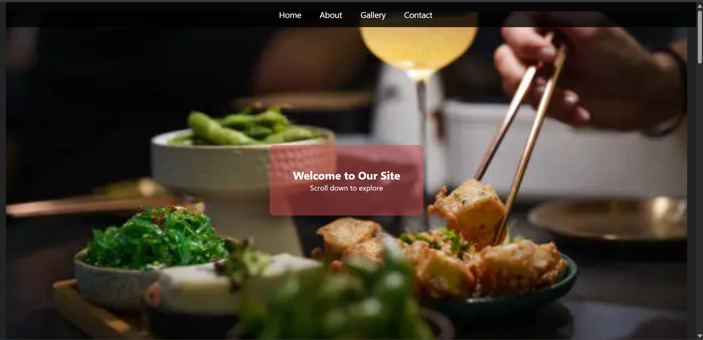

# 🍽 Food Counter Website

Welcome to the *Happy Da Dhaba* 🌟 – a vibrant, scrollable, single-page website designed to showcase a lively food counter experience! This project is ideal for learning or demonstrating front-end web development skills using HTML, CSS, and JavaScript.

---

## 📸 Features

✨ Smooth scroll navigation  
📷 Beautiful image gallery  
🧁 Eye-catching hero section  
💌 Contact form with styling  
🎨 Clean and responsive design  
🔗 Social media links with hover effects  

---

## 🛠 Tech Stack

- 🧱 *HTML5*
- 🎨 *CSS3*
- 💡 *JavaScript* (basic interactivity, optional)
- 🌍 *Font Awesome* for icons

---

## 🖼 Screenshots

> 📸 

---

🧑‍💻 Author

Designed & Developed by Khushi
🔗 GitHub("https://github.com/khushichetule09")
🔗 LinkedIn("https://www.linkedin.com/in/khushi-chetule-761b50328")